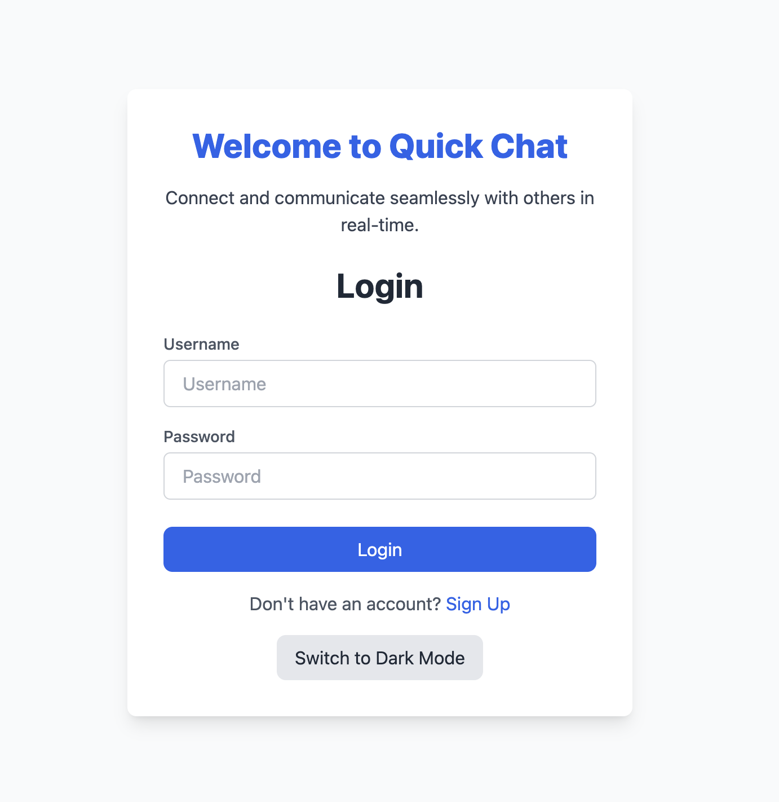

### Updated `README.md`

```markdown
# Chat Application

A real-time chat application built using React and Strapi for seamless front-end and back-end integration. The project enables users to communicate in real-time with persistent storage and dynamic theming.

## Features

- **Real-Time Messaging**: Live chat functionality powered by Socket.io.
- **Theming Support**: Toggle between light and dark modes.
- **Session Management**: Persistent sessions with messages stored in the backend.
- **Quick Chat**: Easily switch between multiple chat sessions.
- **Strapi Backend**: APIs for managing chat sessions and user data.
- **Responsive Design**: Fully optimized for desktop and mobile devices.

## Technologies Used

- **Frontend**:
  - React.js
  - Tailwind CSS for styling
  - Context API for state management
- **Backend**:
  - Strapi (Node.js headless CMS)
  - Socket.io
  - SQLite (default Strapi database, configurable)
- **Other Tools**:
  - LocalStorage for client-side caching

## How to Run the Project Locally

### Prerequisites

Make sure you have the following installed:

- [Node.js](https://nodejs.org/) (version 16 or later)
- [npm](https://www.npmjs.com/) or [yarn](https://yarnpkg.com/)
- [Strapi](https://strapi.io/)

### Steps

#### 1. Clone the Repository

```bash
git clone https://github.com/yourusername/chat-app.git
cd chat-app
```

#### 2. Set Up the Backend (Strapi)

1. Navigate to the `backend/` directory:
   ```bash
   cd backend
   ```
2. Install dependencies:
   ```bash
   npm install
   ```
3. Start the Strapi server:
   ```bash
   npm run develop
   ```
4. Access the Strapi admin panel at:
   ```plaintext
   http://localhost:1337/admin
   ```
   Set up your admin account and configure APIs as needed.

#### 3. Set Up the Frontend

1. Navigate to the `frontend/` directory:
   ```bash
   cd frontend
   ```
2. Install dependencies:
   ```bash
   npm install
   ```
3. Start the React development server:
   ```bash
   npm start
   ```
4. Open the app in your browser:
   ```plaintext
   http://localhost:3000
   ```

#### 4. Connect Frontend to Backend

- Ensure the API URL in the frontend (e.g., `src/config/api.js`) points to your Strapi backend:
  ```javascript
  export const API_URL = "http://localhost:1337";
  ```

## Project Structure

```plaintext
backend/               # Strapi backend files
frontend/              # React frontend files
  ├── src/
      ├── components/  # React components (MessageList, MessageInput, Header, etc.)
      ├── context/     # Context API for theme and session management
      ├── services/    # API and local storage utilities
      ├── App.jsx      # Main application entry point
  ├── public/          # Static assets
```

## Screenshots



  

## Future Improvements

- Implement user authentication via Strapi.
- Add group chat and multimedia messaging.
- Use a cloud database (e.g., MongoDB) for scalable storage.
- Deploy the app using platforms like Vercel (frontend) and Render (backend).

## License

This project is licensed under the MIT License. See the [LICENSE](LICENSE) file for details.

---

Feel free to contribute to this project by forking the repository and submitting pull requests.
```